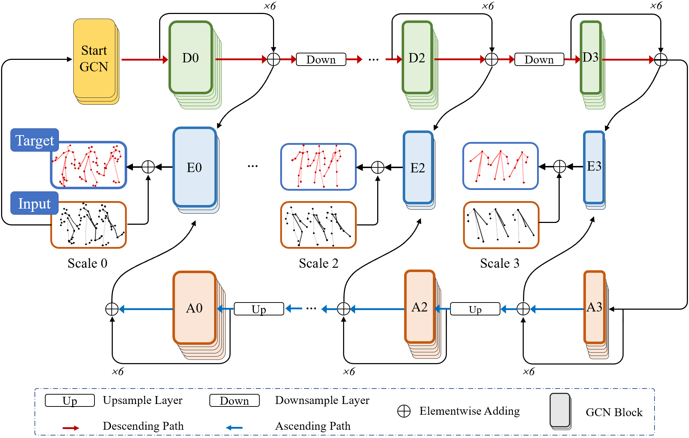

# MSR-GCN

Official implementation of MSR-GCN (ICCV 2021 paper)



## Dependencies

* Pytorch 1.7.0+cu110
* Python 3.8.5


## Get the data
[Human3.6m](http://vision.imar.ro/human3.6m/description.php) in exponential map can be downloaded from [here](http://www.cs.stanford.edu/people/ashesh/h3.6m.zip).

[CMU mocap](http://mocap.cs.cmu.edu/) was obtained from the [repo](https://github.com/chaneyddtt/Convolutional-Sequence-to-Sequence-Model-for-Human-Dynamics) of ConvSeq2Seq paper.

## 不同数据集的处理区别

Human3.6M

+ h3.6m 原本包含 32 个关节点，按 22 -> 12 -> 7 -> 4 划分
+ human 3.6m 包含训练集、验证集、测试集
+ 包含 joint_equal
+ 测试集区分 15 种动作类别
+ 依据验证集指标保存模型
+ 测试集原本是水滴测试，我们改成了海洋测试
+ 测试集的锚点是 4/6 帧
+ 数据格式 10+25=35
+ 200 epoch
+ 短期 10+10->15; 长期 10+25->30

CMU Mocap dataset

+ cmu 原本包含 38 个关节点，按 25 -> 12 -> 7 -> 4 划分
+ cmu mocap 没有验证集
+ 包含 joint_equal
+ 测试集区分动作 8 种动作类别
+ 直接依据训练集结果保存模型
+ 测试集原本是水滴测试，我们改成了海洋测试
+ 测试集的锚点是 4/6 帧
+ 数据格式 10+25=35
+ 900 epoch
+ 不区分长短期 10+25->30


## Citing

If you use our code, please cite our work

```
@inproceedings{lingwei2021msrgcn,
  title={MSR-GCN: Multi-Scale Residual Graph Convolution Networks for Human Motion Prediction},
  author={Lingwei, Dang and Yongwei, Nie and Chengjiang, Long and Qing, Zhang and Guiqing Li},
  booktitle={ICCV},
  year={2021}
}
```

## Acknowledgments

Some of our evaluation code and data process code was adapted/ported from [LearnTrajDep](https://github.com/wei-mao-2019/LearnTrajDep) by [Wei Mao](https://github.com/wei-mao-2019). 

## Licence
MIT
